# etcd中的Raft算法实现原理

## 目录
- [概述](#概述)
- [Raft算法基本原理](#raft算法基本原理)
- [etcd中的Raft实现](#etcd中的raft实现)
- [Raft解决的问题](#raft解决的问题)
- [可能遇到的问题和解决方案](#可能遇到的问题和解决方案)
- [普通Raft vs Multi-Raft](#普通raft-vs-multi-raft)
- [架构图表](#架构图表)
- [总结](#总结)

## 概述

Raft是一个分布式一致性算法，旨在解决分布式系统中多个节点对数据状态达成一致的问题。etcd作为一个分布式键值存储系统，在其核心使用了Raft算法来保证数据的强一致性和高可用性。

## Raft算法基本原理

### 核心概念

**节点状态**：
- **Leader（领导者）**：处理所有客户端请求，负责日志复制
- **Follower（跟随者）**：被动接收Leader的日志条目和心跳
- **Candidate（候选者）**：在选举过程中的临时状态

**关键机制**：
1. **Leader选举**：当Leader失效时，系统自动选举新的Leader
2. **日志复制**：Leader将操作记录复制到所有Follower节点
3. **安全性保证**：确保已提交的日志条目不会丢失

### 工作流程

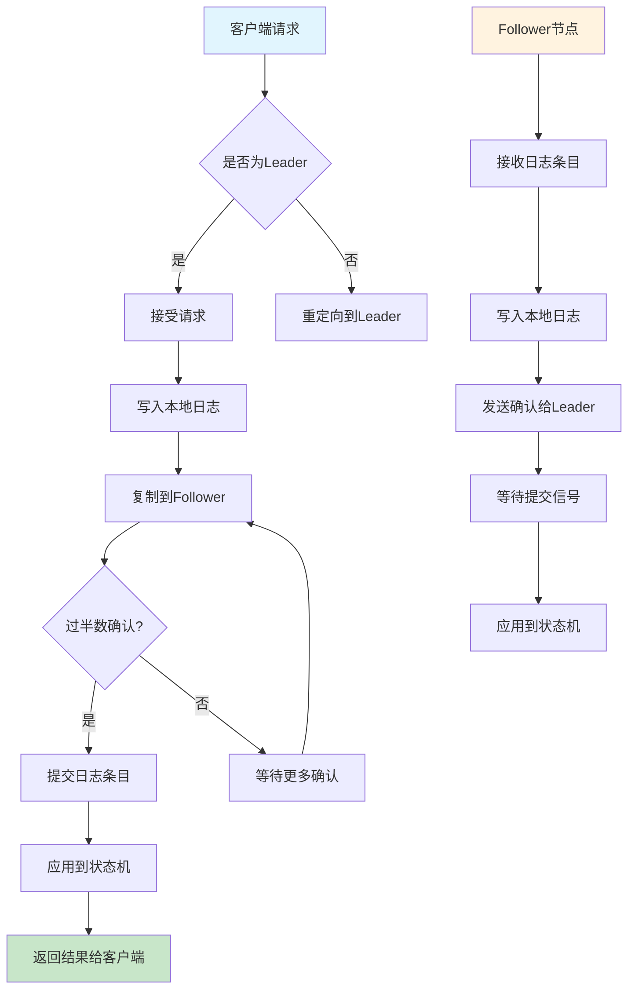

## etcd中的Raft实现

### 核心组件

基于源码分析，etcd的Raft实现包含以下关键组件：

#### 1. raftNode结构
```go
type raftNode struct {
    lg *zap.Logger
    tickMu *sync.RWMutex
    latestTickTs time.Time
    raftNodeConfig
    
    // 快照消息通道
    msgSnapC chan raftpb.Message
    // 应用通道
    applyc chan toApply
    // 读状态通道
    readStateC chan raft.ReadState
    
    ticker *time.Ticker
    td *contention.TimeoutDetector
    stopped chan struct{}
    done chan struct{}
}
```

#### 2. 状态转换机制

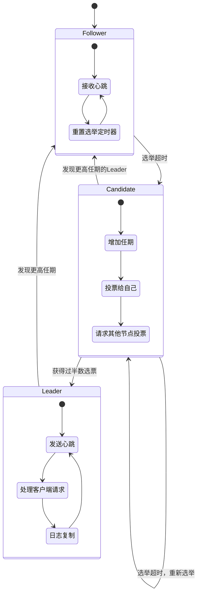

#### 3. 存储层设计

**WAL（Write Ahead Log）**：
- 格式：每个WAL文件以`$seq-$index.wal`命名
- 作用：持久化Raft状态和日志条目
- 特点：8字节对齐，包含CRC校验

**快照机制**：
- 触发条件：当已应用的日志条目数量超过配置的快照计数时
- 作用：压缩日志，提高恢复速度
- 实现：异步创建，避免阻塞正常操作

#### 4. 关键流程实现

**日志复制流程**（基于`server/etcdserver/raft.go`）：
```go
// Leader处理Ready状态
case rd := <-r.Ready():
    if rd.SoftState != nil {
        // 更新Leader状态
        islead = rd.RaftState == raft.StateLeader
        rh.updateLeadership(newLeader)
    }
    
    // 持久化快照和日志
    if !raft.IsEmptySnap(rd.Snapshot) {
        r.storage.SaveSnap(rd.Snapshot)
    }
    r.storage.Save(rd.HardState, rd.Entries)
    
    // Leader发送消息给Follower
    if islead {
        r.transport.Send(r.processMessages(rd.Messages))
    }
```

## Raft解决的问题

### 1. 分布式一致性问题
- **问题**：多个节点如何对数据状态达成一致
- **解决方案**：通过Leader选举和日志复制机制，确保所有节点按相同顺序应用操作

### 2. 脑裂问题（Split-Brain）
- **问题**：网络分区可能导致多个Leader同时存在
- **解决方案**：要求获得过半数（majority）节点的支持才能成为Leader

### 3. 数据丢失问题
- **问题**：节点故障可能导致已提交的数据丢失
- **解决方案**：只有当日志条目被过半数节点确认后才认为已提交

### 4. 可用性问题
- **问题**：单点故障导致系统不可用
- **解决方案**：自动故障检测和Leader重新选举

## 可能遇到的问题和解决方案

### 1. 网络分区问题

**问题描述**：
网络分区可能导致集群被分割为多个子集群，影响系统可用性。

**etcd的解决方案**：
- 使用quorum机制：只有获得过半数节点支持的分区才能继续提供写服务
- PreVote机制：候选者在正式选举前先进行预选举，减少不必要的选举

```go
// etcd配置中的PreVote选项
func raftConfig(cfg config.ServerConfig, id uint64, s *raft.MemoryStorage) *raft.Config {
    return &raft.Config{
        ID:              id,
        ElectionTick:    cfg.ElectionTicks,
        HeartbeatTick:   1,
        Storage:         s,
        CheckQuorum:     true,  // 启用quorum检查
        PreVote:         cfg.PreVote,  // 启用PreVote
        Logger:          NewRaftLoggerZap(cfg.Logger.Named("raft")),
    }
}
```

### 2. 数据一致性问题

**问题描述**：
在v3.5版本中发现的数据不一致问题，一致性索引（consistent index）更新不原子。

**解决方案**：
- 确保一致性索引的原子更新
- 在应用WAL条目时，同时更新一致性索引和数据库状态
- 使用事务保证操作的原子性

### 3. 性能问题

**问题描述**：
- 日志条目过多影响恢复速度
- 频繁的心跳消息占用网络带宽

**解决方案**：
- **快照机制**：定期创建快照，压缩日志
- **批处理**：将多个操作打包处理
- **心跳优化**：合并心跳消息

```go
// 快照触发条件
func (s *EtcdServer) shouldSnapshotToDisk(ep *etcdProgress) bool {
    return (s.forceDiskSnapshot && ep.appliedi != ep.diskSnapshotIndex) || 
           (ep.appliedi-ep.diskSnapshotIndex > s.Cfg.SnapshotCount)
}
```

### 4. 成员变更问题

**问题描述**：
动态添加或移除集群成员可能导致可用性问题。

**解决方案**：
- **配置变更**：使用特殊的配置变更日志条目
- **两阶段提交**：确保配置变更的安全性
- **健康检查**：在添加成员前检查集群健康状态

```go
// 成员添加的健康检查
func (s *EtcdServer) mayAddMember(memb membership.Member) error {
    if !s.Cfg.StrictReconfigCheck {
        return nil
    }
    
    // 检查是否有足够的健康成员
    if !memb.IsLearner && !s.cluster.IsReadyToAddVotingMember() {
        return errors.ErrNotEnoughStartedMembers
    }
    
    // 检查网络连通性
    if !isConnectedFullySince(s.r.transport, time.Now().Add(-HealthInterval), 
                             s.MemberID(), s.cluster.VotingMembers()) {
        return errors.ErrUnhealthy
    }
    
    return nil
}
```

## 普通Raft vs Multi-Raft

### 普通Raft

**特点**：
- 单个Raft组管理整个数据集
- 所有操作都通过同一个Leader处理
- 简单直观，易于理解和实现

**限制**：
- 单Leader瓶颈：所有写操作都必须通过Leader
- 扩展性限制：数据量增大时性能下降
- 资源利用率低：非Leader节点资源利用不充分

### Multi-Raft

**特点**：
- 数据被分割为多个Region/Shard
- 每个Region有独立的Raft组
- 不同Region可以有不同的Leader

**优势**：
- **水平扩展性**：可以通过增加Region数量扩展系统
- **负载分散**：多个Leader并行处理请求
- **故障隔离**：单个Region故障不影响其他Region

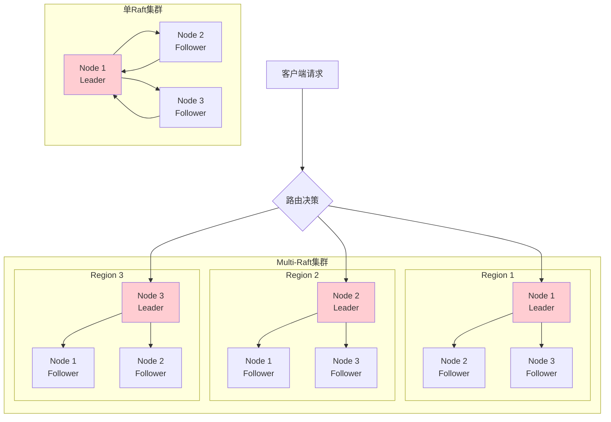

### Multi-Raft的实现挑战

1. **跨Region事务**：需要特殊的分布式事务协议
2. **数据路由**：客户端需要知道数据在哪个Region
3. **Region分裂与合并**：动态调整Region大小
4. **负载均衡**：确保Region在节点间均匀分布

### etcd的选择

etcd选择了**单Raft组**的设计，原因包括：
- **简单性**：避免了Multi-Raft的复杂性
- **强一致性**：更容易保证线性一致性
- **使用场景**：etcd主要用于配置存储，数据量相对较小

但etcd通过以下方式优化性能：
- **读操作优化**：支持从Follower读取（在一定一致性级别下）
- **批处理**：将多个操作批量处理
- **并发控制**：使用MVCC支持并发读写

## 架构图表

### etcd整体架构

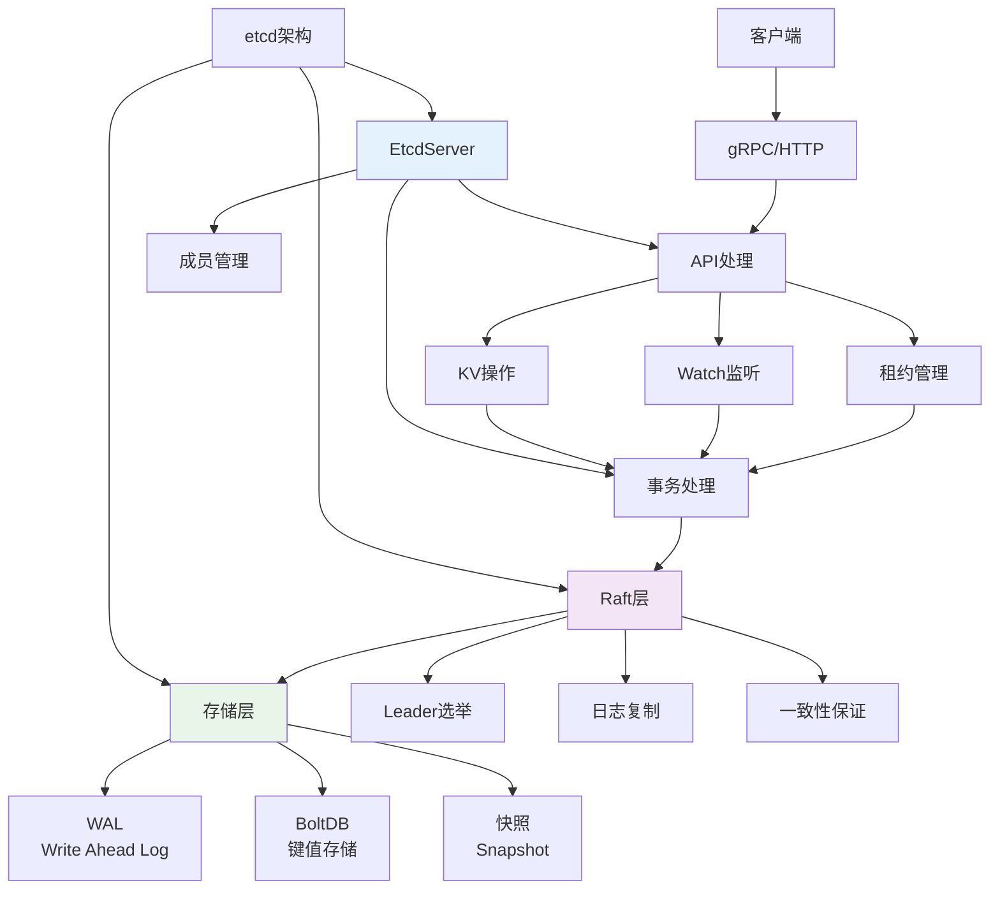

### 关键配置参数

| 参数 | 默认值 | 说明 |
|------|--------|------|
| `election-timeout` | 1000ms | 选举超时时间 |
| `heartbeat-interval` | 100ms | 心跳间隔 |
| `snapshot-count` | 10000 | 触发快照的日志条目数 |
| `max-snapshots` | 5 | 保留的快照文件数量 |
| `max-wals` | 5 | 保留的WAL文件数量 |

## 总结

### Raft算法的核心价值

1. **可理解性**：相比Paxos，Raft更容易理解和实现
2. **强一致性**：保证分布式系统的数据一致性
3. **容错性**：能够容忍少数节点故障
4. **自动恢复**：故障节点恢复后自动同步数据

### etcd中Raft的特色

1. **工程化实现**：考虑了实际生产环境的各种问题
2. **性能优化**：通过快照、批处理等技术提升性能
3. **运维友好**：提供丰富的监控和调试工具
4. **生态集成**：与Kubernetes等系统深度集成

### 适用场景

**适合使用etcd（单Raft）的场景**：
- 配置管理
- 服务发现
- 分布式锁
- 元数据存储

**适合使用Multi-Raft的场景**：
- 大规模数据存储
- 高并发写入
- 需要水平扩展的系统

### 未来发展方向

1. **性能优化**：持续改进Raft算法的性能
2. **多租户支持**：更好的资源隔离
3. **云原生集成**：与云平台更深度的集成
4. **智能运维**：自动化的集群管理和优化

## 深入解答关键问题

### PreVote预选举机制

#### 什么是PreVote？

PreVote（预选举）是Raft算法的一个优化机制，用于减少不必要的选举和网络分区时的干扰。

#### PreVote具体做了什么操作？

**PreVote本质上是在问："如果我现在发起选举，你们会投票给我吗？"**

具体操作包括：

1. **询问投票意愿**：向其他节点发送PreVote请求，询问是否愿意投票
2. **检查资格**：其他节点检查候选者的日志是否足够新
3. **统计支持度**：候选者统计支持票数
4. **决定是否继续**：只有获得过半数支持才进入真正的选举

**关键点**：PreVote**不是**询问是否有Leader，而是询问**是否愿意投票给我当Leader**。

#### PreVote消息内容

```go
// PreVote请求包含的信息
type Message struct {
    Type     MessageType  // MsgPreVote
    To       uint64      // 目标节点ID
    From     uint64      // 发送者ID
    Term     uint64      // 当前任期（不会增加）
    LogTerm  uint64      // 最后日志条目的任期
    Index    uint64      // 最后日志条目的索引
}
```

#### PreVote vs 普通心跳的区别

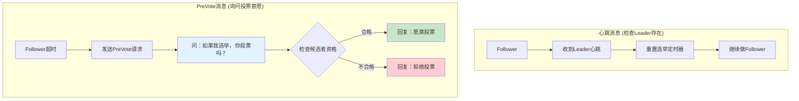

#### 实现逻辑

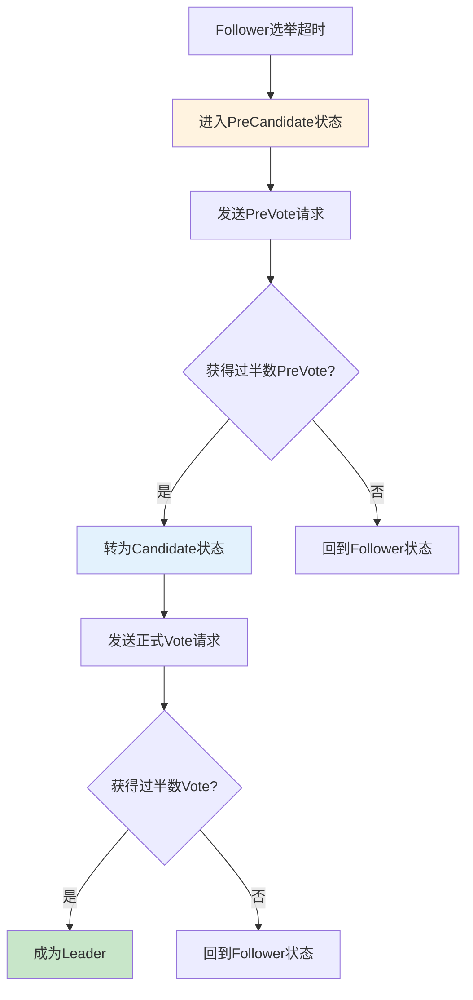

#### PreVote vs Vote的关键区别

**核心区别在于对任期(Term)的处理**：

| 阶段 | 任期处理 | 过半数要求 | 失败后果 |
|------|----------|------------|----------|
| **PreVote** | **不增加任期** | 需要过半数PreVote | 失败后任期不变，可重试 |
| **Vote** | **先增加任期** | 需要过半数Vote | 失败后任期已增加，影响集群 |

#### 详细对比分析

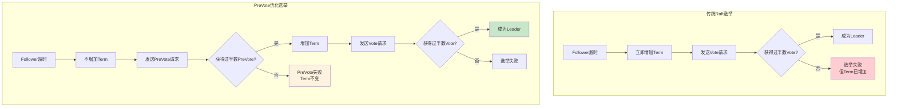

#### 为什么这个区别很重要？

**问题场景示例**：

```
场景：5节点集群，网络分区为[A,B] 和 [C,D,E]
- [C,D,E]有过半数，正常工作，C是Leader
- [A,B]是少数分区，无法选出Leader

传统Raft的问题：
1. A和B不断超时，不断增加Term
2. 网络恢复后，A和B的Term很高(比如Term=100)
3. 当C收到A的高Term消息时，C被迫下台
4. 但A无法获得过半数选票(只有A,B两票)
5. 导致整个集群重新选举，服务中断

PreVote的解决方案：
1. A和B在PreVote阶段就被拒绝(只有2票，不过半)
2. A和B的Term保持不变
3. 网络恢复后，A和B直接同步C的状态
4. 避免了不必要的选举和服务中断
```

#### PreVote的判断逻辑详解

**PreVote询问的具体问题**：
- "我的日志是否足够新？"
- "你是否愿意考虑投票给我？"
- "我是否有资格成为Leader？"

**接收者的判断标准**：

```go
// PreVote请求处理逻辑
func (r *raft) Step(m pb.Message) error {
    switch m.Type {
    case pb.MsgPreVote:
        // 判断是否愿意给PreVote
        canPreVote := false
        
        // 条件1：我还没有投票给别人 OR 我之前投票给了这个候选者
        if r.Vote == None || r.Vote == m.From {
            canPreVote = true
        }
        
        // 条件2：候选者的日志至少和我一样新
        if !r.logUpToDate(m.Index, m.LogTerm) {
            canPreVote = false
        }
        
        // 条件3：如果我知道有活跃的Leader，拒绝PreVote
        if r.checkQuorum && r.lead != None && r.electionElapsed < r.electionTimeout {
            canPreVote = false
        }
        
        if canPreVote {
            r.send(pb.Message{To: m.From, Type: pb.MsgPreVoteResp})
        } else {
            r.send(pb.Message{To: m.From, Type: pb.MsgPreVoteResp, Reject: true})
        }
        
    case pb.MsgVote:
        // 正式Vote会更新Term和投票状态
        if m.Term > r.Term {
            r.Term = m.Term  // 更新任期！
            r.Vote = None
            r.lead = None
        }
        
        canVote := r.Vote == None || r.Vote == m.From
        if canVote && r.logUpToDate(m.Index, m.LogTerm) {
            r.Vote = m.From  // 记录投票！
            r.send(pb.Message{To: m.From, Type: pb.MsgVoteResp})
        } else {
            r.send(pb.Message{To: m.From, Type: pb.MsgVoteResp, Reject: true})
        }
    }
}
```

#### PreVote vs Vote的操作对比

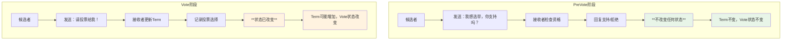

#### 形象的比喻

**PreVote就像问："如果我参加竞选，你会考虑投票给我吗？"**
- 这只是一个意向调查
- 不会改变任何人的投票状态
- 不会影响当前的选举周期

**Vote就像正式投票："请投票给我！"**
- 这是正式的选举投票
- 会记录投票选择
- 会更新选举任期

#### PreVote的完整判断流程

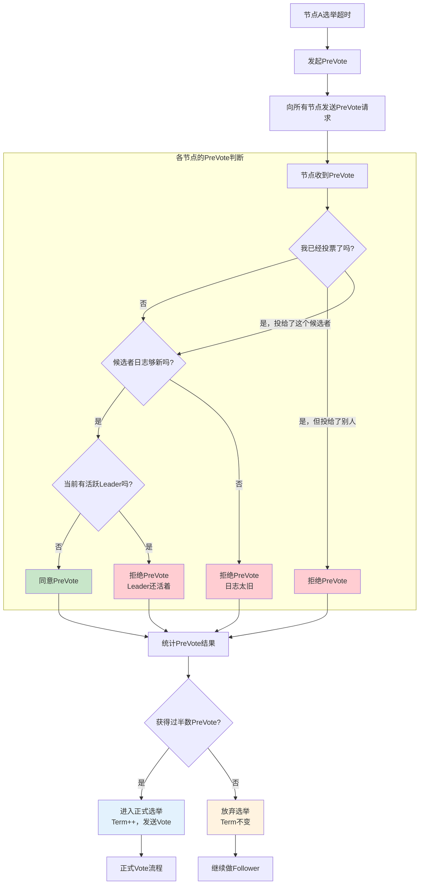

**关键理解**：

1. **PreVote不是询问是否有Leader**，而是询问**"如果我要选举，你们支持我吗？"**

2. **三个主要判断条件**：
   - **投票状态**：我是否已经投票给别人了？
   - **日志新旧**：候选者的日志是否至少和我一样新？
   - **Leader活跃性**：当前是否有活跃的Leader？

3. **PreVote的保护作用**：
   - 如果集群中有活跃Leader，其他节点会拒绝PreVote
   - 这防止了不必要的选举干扰正常运行的集群

#### 解决的具体问题

1. **网络分区干扰**：
   - 防止分区节点重连时用高Term干扰正常集群
   - 示例：分区节点Term=100，正常集群Term=10，PreVote避免干扰

2. **减少选举风暴**：
   - 多节点同时选举时，PreVote失败的节点不会增加Term
   - 避免Term快速增长导致的连锁选举

3. **提高可用性**：
   - 减少因Term冲突导致的Leader下台
   - 保持集群稳定性

```go
// etcd中PreVote的配置
func raftConfig(cfg config.ServerConfig, id uint64, s *raft.MemoryStorage) *raft.Config {
    return &raft.Config{
        ID:              id,
        ElectionTick:    cfg.ElectionTicks,
        HeartbeatTick:   1,
        Storage:         s,
        CheckQuorum:     true,
        PreVote:         cfg.PreVote,  // 启用PreVote机制
        Logger:          NewRaftLoggerZap(cfg.Logger.Named("raft")),
    }
}
```

#### 时序对比图

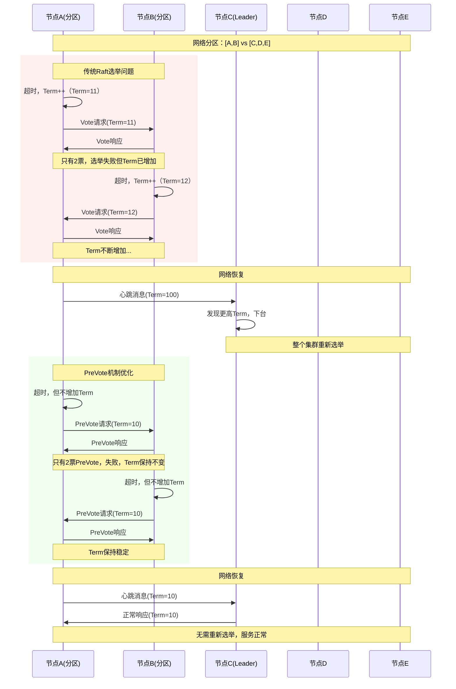

**总结**：PreVote的核心价值在于"先试探，再行动"，通过在不增加Term的前提下进行预选举，避免了无效选举对集群稳定性的影响。这个机制的关键在于**延迟Term的增加**，只有在确认能够获得过半数支持时才真正开始选举过程。

### Raft投票逻辑详解

#### 投票的核心判断条件

基于etcd源码分析，Raft投票逻辑包含以下关键判断：

```go
// 投票决策的完整逻辑
func (r *raft) Step(m pb.Message) error {
    switch m.Type {
    case pb.MsgVote:
        // === 第一步：任期检查和更新 ===
        if m.Term > r.Term {
            // 发现更高任期，立即更新并重置投票状态
            r.Term = m.Term
            r.Vote = None      // 清空之前的投票
            r.lead = None      // 清空Leader信息
            r.becomeFollower(m.Term, None)
        }
        
        // === 第二步：基本投票条件检查 ===
        canVote := false
        
        // 条件1：任期必须匹配
        if m.Term == r.Term {
            // 条件2：投票状态检查 - 要么没投票，要么之前投给了这个候选者
            if r.Vote == None || r.Vote == m.From {
                // 条件3：日志新旧检查 - 候选者日志必须至少和我一样新
                if r.raftLog.isUpToDate(m.Index, m.LogTerm) {
                    canVote = true
                }
            }
        }
        
        // === 第三步：做出投票决定 ===
        if canVote {
            r.Vote = m.From  // 记录投票选择
            r.electionElapsed = 0  // 重置选举计时器
            r.send(pb.Message{To: m.From, Type: pb.MsgVoteResp, Term: r.Term})
        } else {
            r.send(pb.Message{To: m.From, Type: pb.MsgVoteResp, Term: r.Term, Reject: true})
        }
    }
}
```

#### 日志新旧判断算法（logUpToDate）

**这是投票决策中最关键的部分**：

```go
// 判断候选者日志是否至少和当前节点一样新
func (l *raftLog) isUpToDate(lasti, term uint64) bool {
    // 获取本地最后一个日志条目
    lastTerm, lastIndex := l.lastTerm(), l.lastIndex()
    
    // 比较逻辑：
    // 1. 候选者最后日志的Term更高 → 候选者更新
    // 2. Term相同但候选者日志更长 → 候选者更新  
    // 3. 其他情况 → 候选者不够新
    return term > lastTerm || (term == lastTerm && lasti >= lastIndex)
}
```

#### 投票决策流程图

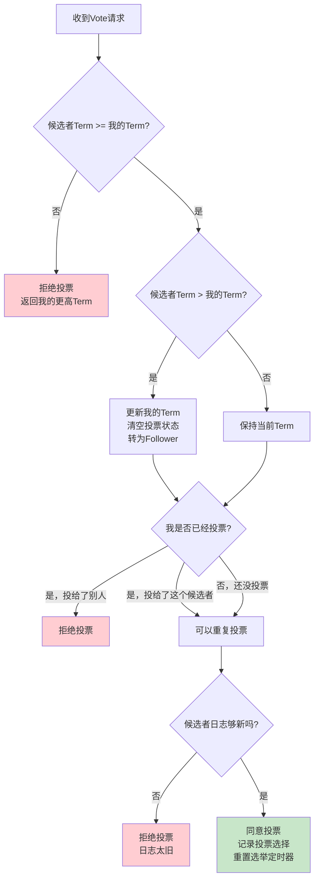

#### 日志新旧比较的具体例子

**场景设置**：
```
节点A：最后日志 [Term=3, Index=10]
节点B：最后日志 [Term=2, Index=15] 
节点C：最后日志 [Term=3, Index=8]
```

**投票决策**：

| 候选者 | 候选者日志 | 投票者 | 投票者日志 | 比较结果 | 投票决定 |
|--------|------------|--------|------------|----------|----------|
| A | [T=3,I=10] | B | [T=2,I=15] | 3>2 | ✅ 投票给A |
| A | [T=3,I=10] | C | [T=3,I=8] | 3=3 且 10>8 | ✅ 投票给A |
| B | [T=2,I=15] | A | [T=3,I=10] | 2<3 | ❌ 拒绝投票 |
| C | [T=3,I=8] | A | [T=3,I=10] | 3=3 但 8<10 | ❌ 拒绝投票 |

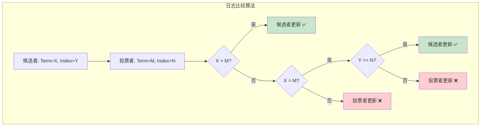

#### 为什么要这样比较日志？

**安全性保证**：确保新Leader包含所有已提交的日志条目

**原理**：
1. **Term优先**：更高Term的日志一定包含之前Term的所有已提交条目
2. **长度次之**：相同Term下，更长的日志包含更多操作
3. **保证连续性**：防止数据丢失和不一致

#### 投票的三个关键原则

1. **每个任期只能投一票**：
   ```go
   // 确保每个节点在同一任期只投票一次
   if r.Vote == None || r.Vote == m.From {
       // 可以投票
   }
   ```

2. **只投票给日志更新的候选者**：
   ```go
   // 保证新Leader拥有所有已提交的日志
   if r.raftLog.isUpToDate(m.Index, m.LogTerm) {
       // 候选者日志足够新
   }
   ```

3. **高任期优先**：
   ```go
   // 发现更高任期立即更新
   if m.Term > r.Term {
       r.Term = m.Term
       r.Vote = None  // 重置投票状态
   }
   ```

#### 完整的投票过程时序图

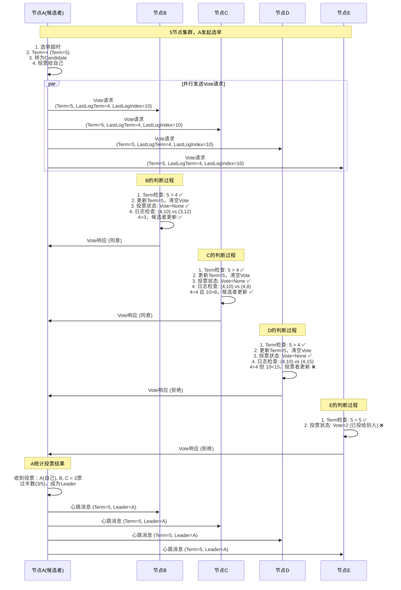

#### 投票决策的关键要点

**1. 任期(Term)是最高优先级**：
- 任何时候收到更高Term的消息，立即更新并转为Follower
- 这保证了集群的时间逻辑一致性

**2. 每个任期只能投一票**：
- 防止一个任期内出现多个Leader
- 实现"过半数"的安全保证

**3. 日志新旧是安全关键**：
- 只有拥有最新日志的节点才能成为Leader
- 确保所有已提交的数据不会丢失

**4. 投票状态的管理**：
```go
// 投票状态转换
r.Vote = None        // 初始状态或Term更新后
r.Vote = candidateID // 投票后记录选择
```

**5. 重复投票的处理**：
- 同一任期内可以重复投票给同一个候选者
- 这处理了网络重传和消息重复的情况

#### 投票决策树

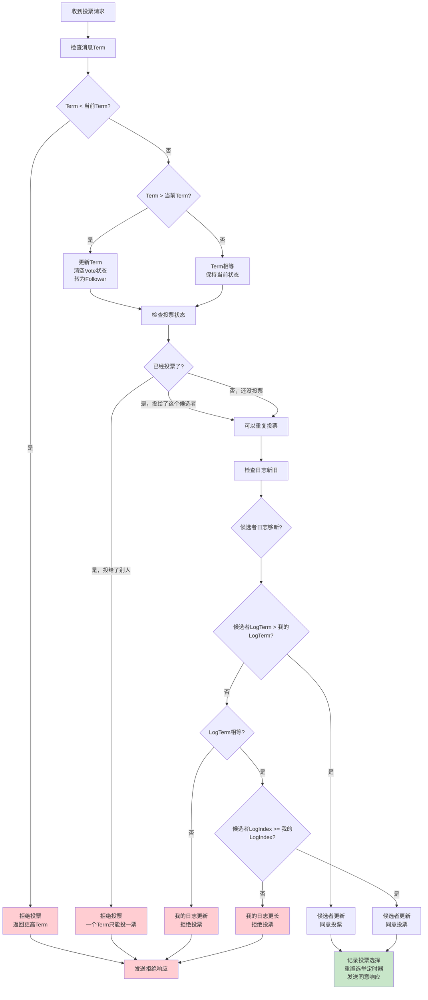

#### 投票逻辑总结

**投票决策的四个层次检查**：

1. **🔸 任期检查**：候选者Term必须 >= 当前Term
2. **🔸 投票状态检查**：每个任期只能投一票
3. **🔸 日志新旧检查**：候选者日志必须至少和自己一样新
4. **🔸 状态更新**：投票后更新相关状态

**关键理解**：
- Raft的投票不是简单的"谁先请求就投给谁"
- 而是基于**数据安全性**的严格判断
- 确保新Leader一定包含所有已提交的数据
- 通过Term和日志比较实现分布式系统的安全性保证

### 一致性索引（Consistent Index）

#### 什么是一致性索引？

一致性索引是etcd中用来追踪已应用到状态机的最新Raft日志条目索引的机制，确保数据库状态与Raft日志的一致性。

```go
type consistentIndex struct {
    // 已应用的最新日志条目索引
    consistentIndex uint64
    // 对应的Raft任期
    term uint64
    
    // 正在应用的索引（临时缓存）
    applyingIndex uint64
    applyingTerm  uint64
    
    be Backend
    mutex sync.Mutex
}
```

#### 用来解决什么问题？

1. **数据一致性保证**：确保数据库状态与Raft日志完全同步
2. **故障恢复**：节点重启时知道从哪个位置开始恢复
3. **读写一致性**：保证读取到的数据是已提交的最新状态

#### 为什么需要原子更新？

**问题场景**：
```
时间序列：
1. 开始应用日志条目 X
2. 更新一致性索引为 X（但未提交数据）
3. 系统崩溃
4. 重启后，系统认为条目 X 已应用，跳过执行
5. 导致数据不一致
```

**解决方案**：
```go
// 原子更新一致性索引和数据
func (s *EtcdServer) apply(es []raftpb.Entry, confState *raftpb.ConfState) {
    for _, e := range es {
        // 设置正在应用的索引
        s.consistIndex.SetConsistentApplyingIndex(e.Index, e.Term)
        
        // 应用数据变更
        s.applyEntryNormal(&e, shouldApplyV3)
        
        // 在事务提交时原子更新一致性索引
        s.setAppliedIndex(e.Index)
        s.setTerm(e.Term)
    }
}
```

### WAL条目内容

#### WAL记录的内容

WAL（Write Ahead Log）记录以下类型的数据：

```go
const (
    MetadataType int64 = iota + 1  // 元数据
    EntryType                      // Raft日志条目
    StateType                      // Raft硬状态
    CrcType                        // CRC校验
    SnapshotType                   // 快照信息
)
```

#### 具体内容格式

```protobuf
message Record {
    optional int64 type  = 1;  // 记录类型
    optional uint32 crc  = 2;  // CRC校验码
    optional bytes data  = 3;  // 实际数据
}

message Snapshot {
    optional uint64 index = 1;      // 快照索引
    optional uint64 term  = 2;      // 快照任期
    optional raftpb.ConfState conf_state = 3;  // 配置状态
}
```

#### WAL文件结构

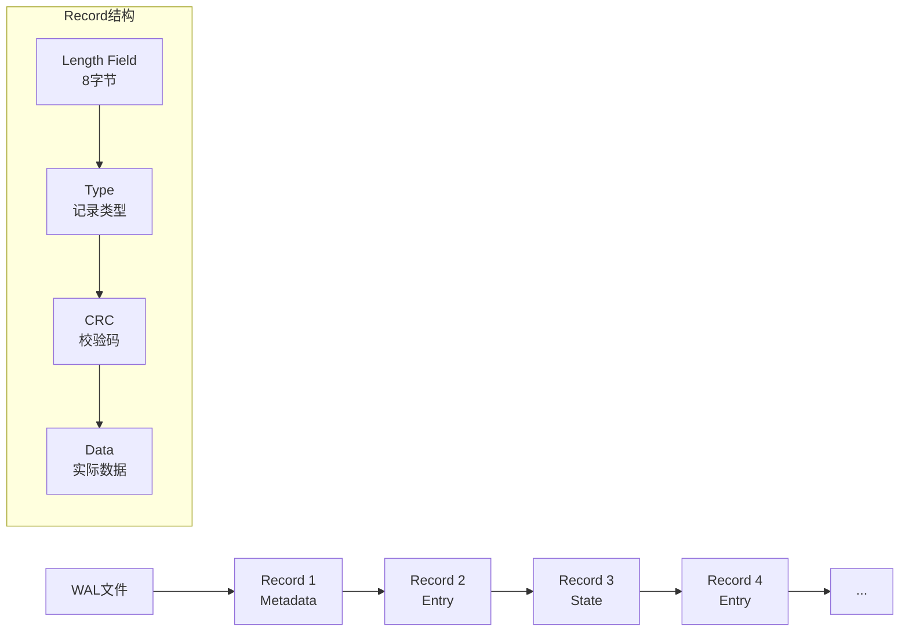

### 传输的日志条目

#### 日志条目内容

Raft节点间传输的日志条目包含：

```go
type Entry struct {
    Term  uint64    // Raft任期
    Index uint64    // 日志索引
    Type  EntryType // 条目类型
    Data  []byte    // 实际数据
}

// 条目类型
const (
    EntryNormal     EntryType = 0  // 普通数据操作
    EntryConfChange EntryType = 1  // 配置变更
)
```

#### 传输的消息类型

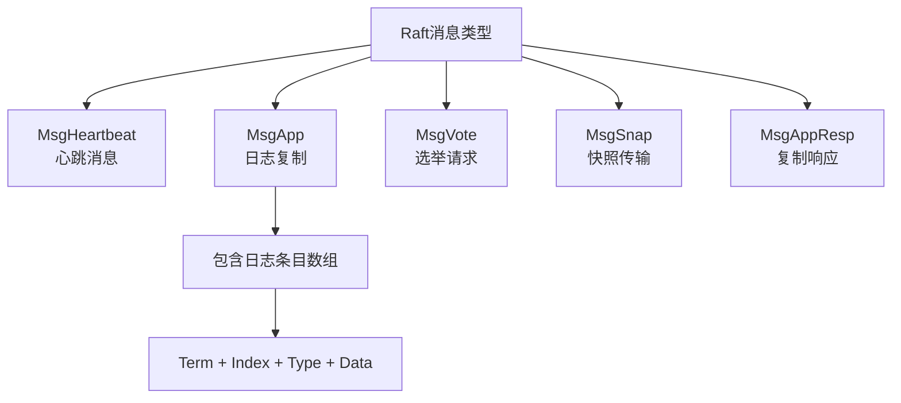

### 快照机制详解

#### 对什么打快照？

etcd对以下内容创建快照：

1. **键值数据**：所有存储的key-value数据
2. **租约信息**：lease相关数据
3. **认证数据**：用户和角色信息
4. **集群配置**：成员信息和配置

```go
// 快照内容结构
type Snapshot struct {
    // 数据库快照
    KV     []byte
    // 租约快照  
    Lease  []byte
    // 认证快照
    Auth   []byte
    // 成员信息
    Member []byte
}
```

#### 为什么需要定期打快照？

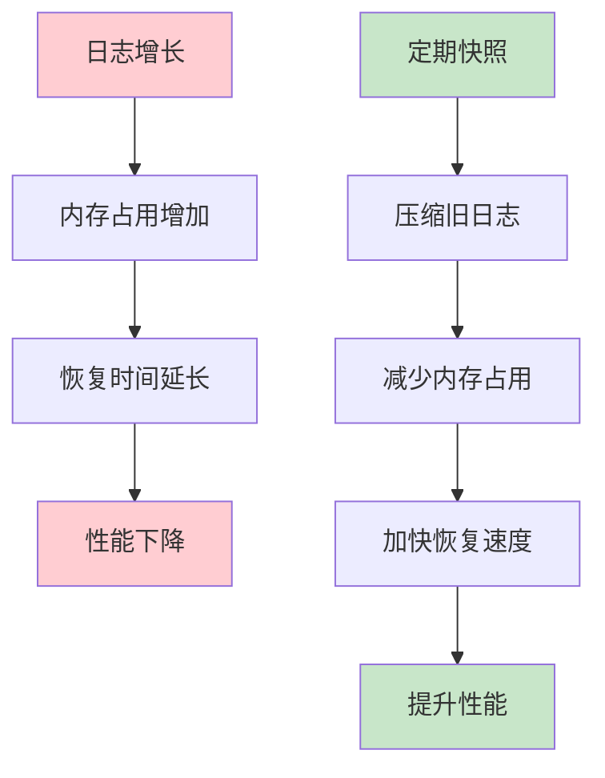

**好处**：
1. **日志压缩**：删除已快照的旧日志条目
2. **快速恢复**：新节点可直接从快照开始
3. **内存优化**：减少内存中的日志条目数量
4. **网络优化**：传输快照比传输大量日志更高效

### 批处理机制

#### 对什么操作打包处理？

1. **WAL写入批处理**：
```go
// 批量保存多个日志条目
func (w *WAL) Save(st raftpb.HardState, ents []raftpb.Entry) error {
    // 批量写入所有条目
    for i := range ents {
        if err := w.saveEntry(&ents[i]); err != nil {
            return err
        }
    }
    return w.saveState(&st)
}
```

2. **数据库事务批处理**：
```go
// 批处理事务
type batchTxBuffered struct {
    batchTx
    buf txWriteBuffer
    pending int  // 待处理操作数
}

func (t *batchTxBuffered) Unlock() {
    // 达到批处理限制时提交
    if t.pending >= t.backend.batchLimit {
        t.commit(false)
    }
}
```

3. **消息发送批处理**：
```go
// 流式传输中的批处理
if len(msgc) == 0 || batched > streamBufSize/2 {
    flusher.Flush()  // 批量发送
    batched = 0
} else {
    batched++  // 累积消息
}
```

### 心跳合并逻辑

#### 合并机制

etcd使用以下逻辑合并心跳消息：

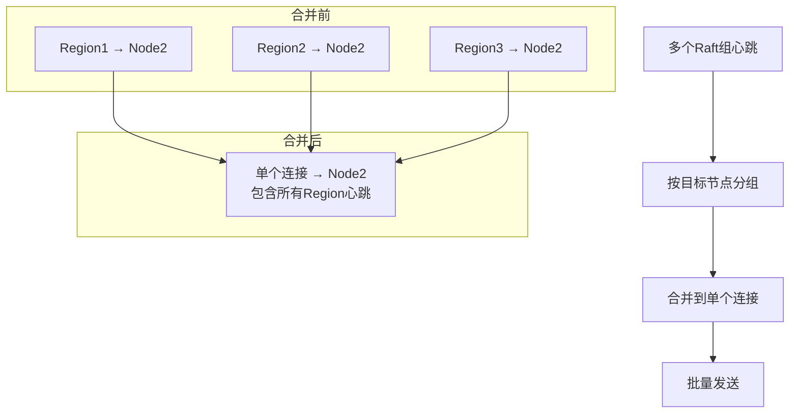

#### 实现代码

```go
// 心跳超时检测和批处理
func (r *raftNode) processMessages(ms []raftpb.Message) []raftpb.Message {
    for i := len(ms) - 1; i >= 0; i-- {
        if ms[i].Type == raftpb.MsgHeartbeat {
            // 检测心跳发送是否及时
            ok, exceed := r.td.Observe(ms[i].To)
            if !ok {
                r.lg.Warn("leader failed to send heartbeat on time")
                heartbeatSendFailures.Inc()
            }
        }
    }
    return ms
}
```

### Multi-Raft详细分析

#### Region分割机制

**分割触发条件**：
1. Region大小超过阈值（默认96MB）
2. 键数量超过限制
3. 负载热点检测

**分割流程**：
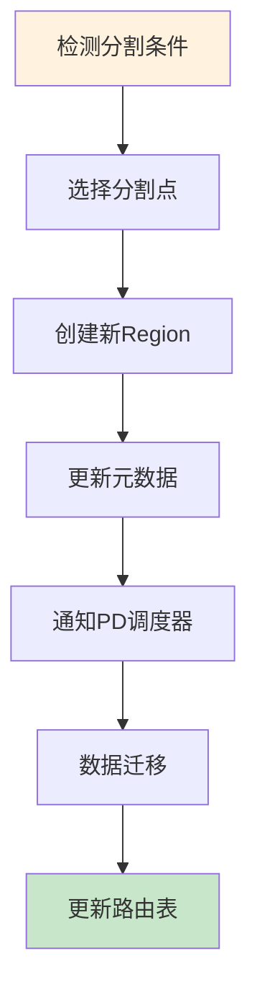

#### 路由机制

**数据路由策略**：
```go
// TiKV的Region路由
type Region struct {
    ID        uint64    // Region ID
    StartKey  []byte    // 起始键
    EndKey    []byte    // 结束键
    Peers     []Peer    // 副本列表
    Epoch     RegionEpoch // 版本信息
}

// 路由查找
func (c *Client) locateRegion(key []byte) (*Region, error) {
    // 根据key查找对应的Region
    return c.regionCache.LocateKey(key)
}
```

**路由更新机制**：
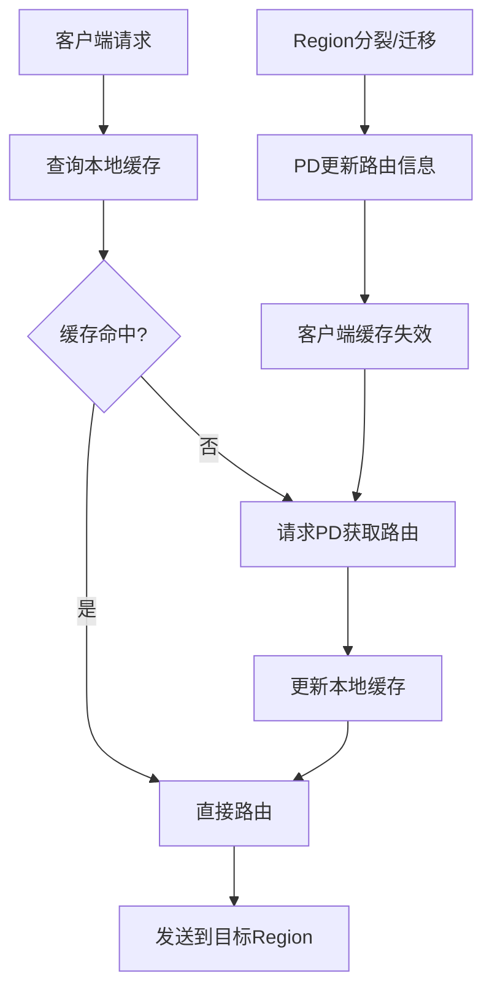

#### Region数量调整

**动态调整机制**：
1. **分裂**：Region过大时自动分裂
2. **合并**：相邻小Region可以合并
3. **迁移**：负载均衡时Region在节点间迁移

**是否使用一致性哈希环？**

Multi-Raft系统通常**不使用**一致性哈希环，而是使用**Range分区**：

```mermaid
graph LR
    A[一致性哈希] --> B[优点：节点增减时数据迁移少]
    A --> C[缺点：范围查询效率低]
    
    D[Range分区] --> E[优点：范围查询高效]
    D --> F[优点：相关数据局部性好]
    D --> G[缺点：可能出现热点]
    
    style D fill:#c8e6c9
    style E fill:#c8e6c9
    style F fill:#c8e6c9
```

**TiKV使用Range分区的原因**：
- 支持高效的范围扫描
- 相关键值的局部性更好
- 分裂和合并操作更简单
- 通过PD调度解决热点问题

#### 跨Region事务

**什么时候需要跨Region事务？**

1. **事务涉及多个键范围**：
```sql
-- 示例：转账操作涉及两个账户
BEGIN;
UPDATE account SET balance = balance - 100 WHERE id = 'user1';  -- Region A
UPDATE account SET balance = balance + 100 WHERE id = 'user2';  -- Region B  
COMMIT;
```

2. **二级索引更新**：
```sql
-- 更新记录时需要同时更新索引
UPDATE user SET name = 'new_name' WHERE id = 123;
-- 主表在Region A，索引在Region B
```

**跨Region事务实现**：

```mermaid
graph TD
    A[客户端发起事务] --> B[协调者选择]
    B --> C[两阶段提交开始]
    C --> D[Phase 1: Prepare]
    D --> E[所有Region投票]
    E --> F{所有Region同意?}
    F -->|是| G[Phase 2: Commit]
    F -->|否| H[Phase 2: Abort]
    G --> I[事务提交成功]
    H --> J[事务回滚]
    
    style I fill:#c8e6c9
    style J fill:#ffcdd2
```

### etcd中的Multi-Raft实现

**etcd是否实现了Multi-Raft？**

**答案：否**。etcd使用**单Raft组**设计，原因如下：

1. **使用场景**：etcd主要用于配置存储，数据量相对较小
2. **简单性**：避免Multi-Raft的复杂性
3. **一致性**：更容易保证强一致性
4. **性能**：对于etcd的使用场景，单Raft组性能足够

**etcd的优化策略**：
```go
// 而是通过以下方式优化性能
type EtcdServer struct {
    // 1. MVCC支持并发读写
    kv mvcc.KV
    
    // 2. 读操作优化
    readMu sync.RWMutex
    
    // 3. 批处理优化
    batchTx backend.BatchTx
    
    // 4. 异步应用
    applyc chan toApply
}
```

### 开源Multi-Raft实现方案

#### 1. TiKV (TiDB)

**架构**：
```mermaid
graph TD
    A[TiDB SQL层] --> B[TiKV存储层]
    B --> C[PD调度器]
    
    subgraph "TiKV节点"
        D[RaftStore] --> E[Region 1]
        D --> F[Region 2]  
        D --> G[Region 3]
        E --> H[RocksDB]
        F --> H
        G --> H
    end
    
    C --> I[路由管理]
    C --> J[负载均衡]
    C --> K[故障检测]
```

**特点**：
- 基于Range的数据分区
- 每个Region独立的Raft组
- PD提供全局调度和元数据管理
- 支持动态Region分裂和合并

#### 2. CockroachDB

**架构**：
```mermaid
graph TD
    A[SQL层] --> B[KV层]
    B --> C[Multi-Raft]
    
    subgraph "CockroachDB节点"
        D[Store] --> E[Range 1]
        D --> F[Range 2]
        D --> G[Range 3]
        E --> H[RocksDB]
        F --> H  
        G --> H
    end
    
    I[Gossip协议] --> J[集群发现]
    I --> K[元数据同步]
```

**特点**：
- 每个Range独立的Raft组
- 心跳消息合并优化
- 基于Gossip的去中心化元数据管理
- 强一致性事务支持

#### 3. 其他开源实现

**Dragonboat**：
- Go语言实现的Multi-Raft库
- 支持多个独立的Raft组
- 高性能的消息传输

**Hashicorp Raft**：
- 单Raft组实现
- 广泛用于Consul、Nomad等产品

**实现对比表**：

| 系统 | 语言 | 分区方式 | 元数据管理 | 事务支持 |
|------|------|----------|------------|----------|
| TiKV | Rust | Range | 中心化(PD) | 2PC |
| CockroachDB | Go | Range | 去中心化(Gossip) | 2PC |
| etcd | Go | 无分区 | 单Raft组 | MVCC |

### 总结

Multi-Raft是大规模分布式存储系统的重要技术，通过将数据分片到多个独立的Raft组中，实现了水平扩展和高性能。然而，它也带来了复杂的路由、事务和一致性挑战。etcd选择单Raft组设计体现了"简单即美"的哲学，在满足使用场景的前提下，优先保证系统的可靠性和可维护性。

不同的系统根据自身的使用场景和设计目标，选择了不同的Raft实现方式，这为我们在设计分布式系统时提供了宝贵的参考。

Raft算法作为分布式一致性的重要解决方案，在etcd中的成功实现为构建可靠的分布式系统提供了重要参考。理解其原理和实现细节，对于设计和维护分布式系统具有重要意义。
